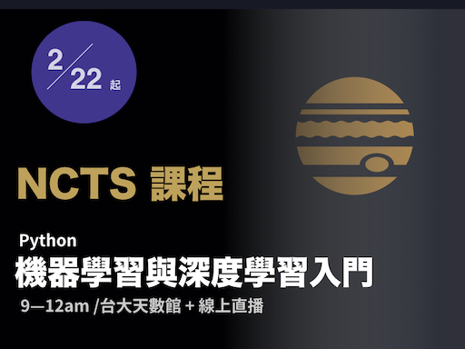

# Python 機器學習與人工智慧入門

這裡是「Python 機器學習與人工智慧入門」課程相關資訊、程式碼等的網頁。目前 2019 年 2 月 22 日起在台大理論中心開課中。上課時間是每週五 9:10--12:10, 第三節課是演習課。

【線上直播連結】
http://bit.ly/aimath_video

直播都會錄影。

## 修課作業

如果是修課同學, 請一定要加入 Facebook 社團:

【政大魔法程式家】
https://www.facebook.com/groups/159902691120219/

作業直接在上面回應。正式修課同學不要忘了回應要加上 `[NCTS]` 字眼, 方便登記成績。

## 期中個人小專題

期中每位同學要交一個小專題! 不一定要很難很大, 主要是在不斷的作業中, 看看有沒有什麼有趣的想法。

## 期末專題

用深度學習解決一個實務上的問題! 這是小組作業 (堅持要個人也可以), 我們會讓大家提專題的計畫, 你可以招集對這個問題有興趣的同學一起來!

## 閃電秀

每週最多五位同學, 可以參加「閃電秀」。自選一個小小的主題, 比方說 Python 小技巧。每位同學最長不超過五鐘! 參加閃電秀的同學, 我們「真人教室」第一排有為大家準備的保留席!